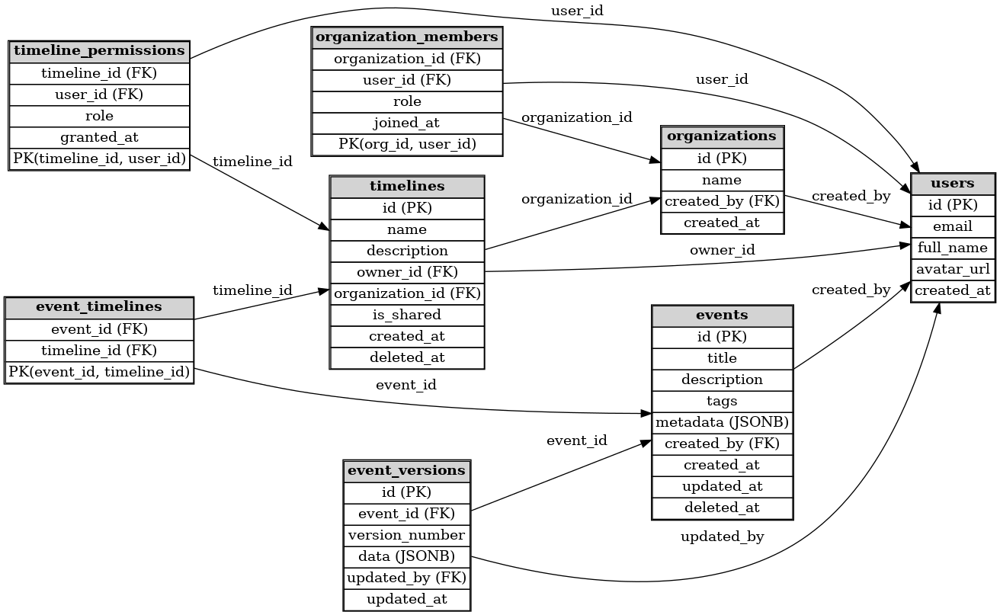

## **Schema Overview**

The schema supports:

* **Multi-user authentication & collaboration** (users, organizations/teams)
* **Events that can belong to multiple timelines** (many-to-many relationships)
* **Role-based permissions** (owner, editor, viewer)
* **Version history & soft deletes** (no permanent data loss)
* **Future extensibility** (media, comments, reactions, linked events)

---

### **Tables**

#### 1. `users`

Stores all registered users (Supabase will auto-manage most fields).

```sql
CREATE TABLE users (
    id UUID PRIMARY KEY DEFAULT gen_random_uuid(),
    email TEXT UNIQUE NOT NULL,
    full_name TEXT,
    avatar_url TEXT,
    created_at TIMESTAMP DEFAULT NOW()
);
```

* Supabase Auth provides the `id` and manages tokens.
* This is your core identity record for joins.

---

#### 2. `organizations`

Groups users into organizations (for team or company accounts).

```sql
CREATE TABLE organizations (
    id UUID PRIMARY KEY DEFAULT gen_random_uuid(),
    name TEXT NOT NULL,
    created_by UUID REFERENCES users(id),
    created_at TIMESTAMP DEFAULT NOW()
);
```

---

#### 3. `organization_members`

Maps users to organizations with roles (admin, member, viewer).

```sql
CREATE TABLE organization_members (
    organization_id UUID REFERENCES organizations(id) ON DELETE CASCADE,
    user_id UUID REFERENCES users(id) ON DELETE CASCADE,
    role TEXT CHECK (role IN ('admin', 'member', 'viewer')),
    joined_at TIMESTAMP DEFAULT NOW(),
    PRIMARY KEY (organization_id, user_id)
);
```

---

#### 4. `timelines`

Each timeline belongs to a user or an organization (for shared use).

```sql
CREATE TABLE timelines (
    id UUID PRIMARY KEY DEFAULT gen_random_uuid(),
    name TEXT NOT NULL,
    description TEXT,
    owner_id UUID REFERENCES users(id),
    organization_id UUID REFERENCES organizations(id),
    is_shared BOOLEAN DEFAULT FALSE,
    created_at TIMESTAMP DEFAULT NOW(),
    deleted_at TIMESTAMP
);
```

---

#### 5. `timeline_permissions`

Defines which users can access which timelines (beyond ownership).

```sql
CREATE TABLE timeline_permissions (
    timeline_id UUID REFERENCES timelines(id) ON DELETE CASCADE,
    user_id UUID REFERENCES users(id) ON DELETE CASCADE,
    role TEXT CHECK (role IN ('owner', 'editor', 'viewer')),
    granted_at TIMESTAMP DEFAULT NOW(),
    PRIMARY KEY (timeline_id, user_id)
);
```

---

#### 6. `events`

Events are journal entries; can hold flexible metadata with JSONB.

```sql
CREATE TABLE events (
    id UUID PRIMARY KEY DEFAULT gen_random_uuid(),
    title TEXT NOT NULL,
    description TEXT,
    tags TEXT[],
    metadata JSONB DEFAULT '{}'::jsonb,  -- for media, reactions, etc.
    created_by UUID REFERENCES users(id),
    created_at TIMESTAMP DEFAULT NOW(),
    updated_at TIMESTAMP DEFAULT NOW(),
    deleted_at TIMESTAMP
);
```

---

#### 7. `event_timelines`

Many-to-many mapping of events to timelines.

```sql
CREATE TABLE event_timelines (
    event_id UUID REFERENCES events(id) ON DELETE CASCADE,
    timeline_id UUID REFERENCES timelines(id) ON DELETE CASCADE,
    PRIMARY KEY (event_id, timeline_id)
);
```

---

#### 8. `event_versions`

Version history for every event (audit + rollback).

```sql
CREATE TABLE event_versions (
    id BIGSERIAL PRIMARY KEY,
    event_id UUID REFERENCES events(id) ON DELETE CASCADE,
    version_number INT NOT NULL,
    data JSONB NOT NULL,  -- snapshot of title, description, tags, etc.
    updated_by UUID REFERENCES users(id),
    updated_at TIMESTAMP DEFAULT NOW()
);
```

---

### **How It Works**

* **Row-Level Security (RLS)** ensures a user can only see events and timelines they own or have permissions for.
* **Soft Deletes**: `deleted_at` ensures no permanent loss (you can restore or archive).
* **Version History**: `event_versions` logs every change for rollback.
* **Flexible Data**: `metadata` JSONB supports future features without migrations (media, reactions, links).

---



# Reasoning
---

## **1. Core Database Choice: Supabase (PostgreSQL + JSONB)**

### **Why PostgreSQL (via Supabase)?**

* **ACID Transactions & Strong Consistency**:
  Essential for collaborative editing, version history, and ensuring no conflicting data during real-time updates.
* **Flexible Data Modeling (JSONB)**:
  Lets you store future features like media, comments, reactions, or linked events **without major schema rewrites**.
* **Real-Time Sync (Built-in)**:
  Supabase streams database changes via WebSockets automatically, so when a timeline or event updates, **all connected clients see it instantly**—without building a separate Pub/Sub system.
* **Analytics-Friendly**:
  PostgreSQL supports aggregations, materialized views, and time-series queries (for activity patterns and reporting).
* **Portable Across Clouds**:
  Can migrate to AWS RDS, GCP Cloud SQL, Azure Database, or self-host because it’s just standard PostgreSQL.

---

## **2. Authentication & User Management: Supabase Auth (with Future-Proofing)**

### **Why Start with Supabase Auth?**

* **Integrated Auth + Database**:
  User identities automatically link to your Postgres tables, so **Row-Level Security (RLS)** can enforce permissions (e.g., “only show timelines the user has access to”).
* **Supports Multiple Methods**:
  Email/password, magic links, OAuth (Google, Apple, GitHub) from day one.
* **Low-Ops**:
  No separate identity provider to configure for the MVP stage.

### **How to Future-Proof?**

* Design schema for **multi-tenancy and role-based access control** now:

  * `users` table (for Supabase users)
  * `organizations` or `teams` table (to group users)
  * `permissions` table (maps users to timelines/events with roles like owner, editor, viewer)
* When scaling to **enterprise (100K+ users, SSO)**:

  * Integrate **Auth0 or WorkOS** for SAML/OIDC without changing your core database.
  * Supabase will continue to manage your application data; only authentication will be swapped.

---

## **3. Scalability & Performance Plan**

### **Short Term (MVP – \~1K users):**

* Supabase handles **real-time sync, row-level security, and backups** out of the box.
* Index timelines and tags for **fast querying**.
* Use **pgvector** if you add semantic search or AI recommendations.

### **Medium Term (10K–100K users, thousands of entries/hour):**

* Add **read replicas and caching (Redis or Varnish)** for heavy read traffic.
* Use **partitioned tables** for time-series data (older events can be archived into cheaper storage).

### **Long Term (Enterprise scale):**

* For **global teams**, integrate **multi-region Postgres** (NeonDB or Crunchy Bridge).
* If timeline relationships become highly complex (e.g., heavy graph queries across shared events), **add Neo4j Aura as a secondary graph database** for those views, while Postgres remains the source of truth.

---

## **4. Version History & Backups**

* Use **soft deletes and audit tables** (`deleted_at`, `version`, `updated_by`) so nothing is ever permanently lost.
* Create **event history tables** for every significant update (Supabase supports triggers for automatic logging).
* Enable **automated backups and point-in-time recovery** (native in Supabase and all major Postgres providers).

---

## **5. Why This Approach Works**

* **Balances simplicity (MVP)** and **scalability (future growth)**.
* Keeps you **cloud-agnostic** (Postgres is portable; Supabase is open-source).
* Avoids **vendor lock-in** (you’re not stuck with Firebase/DynamoDB, which make migration hard).
* Covers **real-time collaboration**, **strong consistency**, and **analytics** without introducing multiple databases too early.
* Prepares for **enterprise needs** (SSO, massive scale) by separating **authentication** and **application data** when needed.

---

